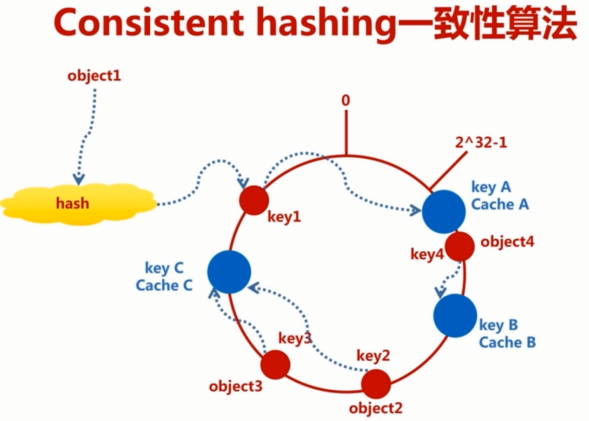
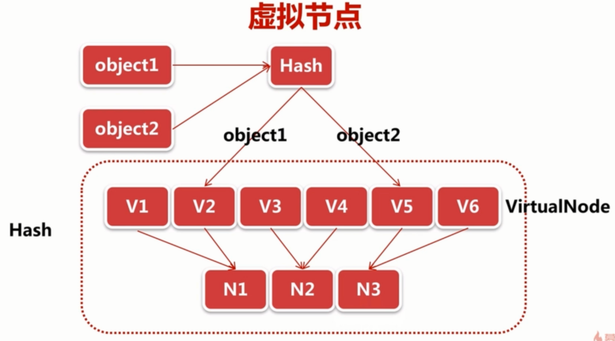
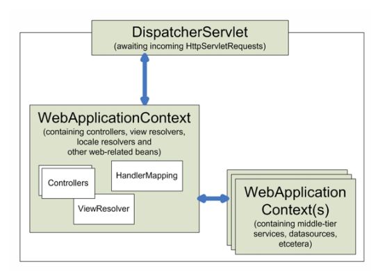
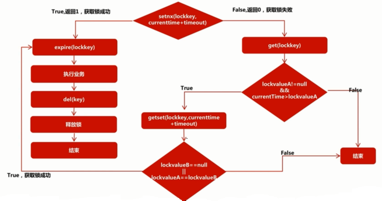

## Java企业级电商项目演进——Tomcat集群和Redis分布式

在[Java从零到企业级电商项目实战 **I**期](https://github.com/tanglei302wqy/tlmall-springboot)基础上进行演进，主要涉及到Tomcat集群和Redis分布式锁，项目来自[慕课网](https://coding.imooc.com/class/162.html)，课程主要不同点：

- 使用Spring Boot整合代替SSM整合
- 注解式开发，包括注解式项目配置以及mybatis中sql语句

项目文件结构：

```txt
tlmall-springboot-ii
 +- images
 |   +- img_1_in_markdown.png
 |   +- ...
 |   +- img_n_in_markdown.png
 +- other
 |   +- image.sherman.com.conf					// Nginx本地路径转发
 |   +- www.sherman.com.conf    				// Nginx负载均衡配置策略
 |   +- nginx.conf						// Nginx主配置文件
 +- questions.md						// 项目中遇到问题汇总
 +- pom.xml							// pom Maven依赖
 +- README.md							// readme文件
 +- src
     +- main
         +- java
         |   +- fun
         | 	 +- sherman
         | 	     +- tlmall
         |		 +- common				// 通用库封装
         |	         |   +- Const.java
         |		 |	 +- RedisPool.java
         |		 |	 +- RedissonManager.java
         |	 	 |	 +- ResponseCode.java
         |		 |	 +- ServerResponse.java
         |		 |	 +- ShardedRedisPool.java
         |		 +- config				// Spring&SpringMVC配置类
         |		 |   +- MainConfig.java
         |		 |   +- SpringMvcConfig.java
         |		 +- controller
         |		 |   +- backend				// 后台控制器
         |		 |   |   +- CategoryManageController.java
         |		 |   |   +- OrderManageController.java
         |		 |   |   +- ProductManageController.java
         |		 |   |   +- UserManageController.java
         |		 |   +- portal				// 门户控制器
         |		 |   |   +- CartController.java
         |		 |   |   +- OrderController.java
         |		 |   |   +- ProductController.java
         |		 |   |   +- ShippingController.java
         |		 |   |   +- UserController
         |		 +- dao					// dao层
         |		 |   +- CartDao.java
         |		 |   +- CategoryDao.java
         |		 |   +- OrderDao.java
         |		 |   +- OrderItemDao.java
         |		 |   +- PayInfoDao.java
         |		 |   +- ProductDao.java
         |		 |   +- ShippingDao.java
         |		 |   +- UserDao.java
         |		 +- domain				// domain对象
         |		 |   +- Cart.java
         |		 |   +- Category.java
         |		 |   +- Order.java
         |		 |   +- OrderItem.java
         |		 |   +- PayInfo.java
         |		 |   +- Product.java
         |		 |   +- Shipping.java
         |		 |   +- User.java
         |		 +- exception				// 自定义异常处理器
         |		 |   +- CustomerExceptionHandler.java
         |		 +- filter				// 重置用户登录有效期的过滤器
         |		 |   +- SessionExpireFilter.java
         |		 +- interceptor				// 管理员权限统一拦截
         |		 |   +- AdminAuthorityInterceptor.java
         |		 +- provider				// 动态SQL
         |		 |   +- CartProvider.java
         |		 |   +- CategoryProvider.java
         |		 |   +- OrderProvider.java
         |		 |   +- ProductProvider.java
         |		 |   +- ShippingProvider.java
         |		 |   +- UserProvider.java
         |		 +- service				// service层
         |		 |   +- impl						
         |		 |   |   +- CartServiceImpl.java
         |		 |   |   +- CategoryServiceImpl.java
         |		 |   |   +- FileServiceImpl.java
         |		 |   |   +- OrderServiceImpl.java
         |		 |   |   +- ProductServiceImpl.java
         |		 |   |   +- ShippingServiceImpl.java
         |		 |   |   +- UserServiceImpl.java
         |		 |   +- ICartService.java
         |		 |   +- ICategoryService.java
         |		 |   +- IFileService.java
         |		 |   +- IOrderService.java
         |		 |   +- IProductService.java
         |		 |   +- IShippingService.java
         |		 |   +- IUserService.java
         |		 +- task				// 自动关单Schedule
         |		 |   +- CloseOrderTask.java
         |		 +- util				// 工具类封装
         |		 |   +- BigDecimalUtil.java
         |		 |   +- CookieUtil.java
         |		 |   +- DateTImeUtil.java
         |		 |   +- FtpUtil.java
         |		 |   +- JacksonUtil.java
         |		 |   +- MD5Util.java
         |		 |   +- PropertiesUtil.java
         |		 |   +- RedisUtil.java
         |		 |   +- ShardedRedis.Util.java
         |		 +- vo					// VO对象
         |		     +- CartProductVo.java
         |		     +- CartVo.java
         |		     +- OrderItemVo.java
         |		     +- OrderProductVo.java
         |		     +- OrderVo.java
         |		     +- ProductDetailVo.java
         |		     +- ProductListVo.java
         |		     +- ShippingVo.java
         +- resources.dev					// Maven环境隔离-dev环境
         |   +- logback-spring.xml
         |   +- zfbinfo.properties
         +- resoueces.prod					// Maven环境隔离-prod环境
         |   +- logback_spring.xml
         |   +- zfbinfo.properties
         +- resources.test					// Maven环境隔离-test环境
         |   +- logback_spring.xml
         |   +- zfbinfo.properties.xml
         +- resources
             +- templates
             |   +- error.html
             |   +- index.html
             +- application.properties				// Spring Boot主配置文件
             +- logback-spring.xml				// logback配置文件
             +- zfbinfo.properties				// 支付宝配置文件
```


## 项目结构

- 集成Lombok框架及反编译工具
- Maven环境隔离
- Tomcat&Nginx集群部署
- Redis基础
- 单点登录
- Redis分布式算法&分布式连接池
- Spring-Session无侵入式集成
- Spring MVC异常处理
- 拦截器管理员权限统一校验
- Restful风格改造
- Spring Schedule定时关单
- 分布式锁原理&实现
- Redisson无侵入式集成


## 项目环境&参考资料

参考[**I**期课程仓库](https://github.com/tanglei302wqy/tlmall-springboot#%E9%A1%B9%E7%9B%AE%E7%8E%AF%E5%A2%83)


## 项目总结

### 一、集成Lombok框架

Lombok：通过简单注解来精简代码达到消除冗长代码的目的，lombok实现了JSR 269 API（JSR 269 Pluggable Annotation Processing API）规范。

#### 1.1 IDEA集成lombok

- IDEA下载插件
- maven中引入lombok依赖
```xml
<dependency>
    <groupId>org.projectlombok</groupId>
    <artifactId>lombok</artifactId>
    <version>1.18.10</version>
    <scope>provided</scope>
</dependency>
```

#### 1.2 常用注解

包含属性用：**of**，排除属性用：**exclude**

- @Setter
- @Getter
- @NoArgsConstructor：无参构造器
- @AllArgsConstructor：全参构造器
- @ToString
- @Data：相当于：@Setter + @Getter + @EqualsAndHashCode + @ToString
- @EqualsAndHashCode
- @EqualsAndHashCode(exclude = {"id", "name"})
- @EqualsAndHashCode(of = {"status", "sortOrder"})

#### 1.3 反编译工具

使用反编译工具可以看到lombok底层对应工作，除此之外还能对enum、语法糖等底层实现进行查看：

- jad:star:：http://sur.ly/i/jd.benow.ca/
- java decompiler ca：http://java-decompiler.github.io/

------


### 二、Maven环境隔离

[填坑](https://github.com/tanglei302wqy/tlmall-springboot-ii/blob/master/questions.md)

> 1. maven打包时如何加入本地lib


Maven环境隔离在实际开发环境非常有用，用户隔离环境之间各种配置存在的差异。

#### 2.1 具体配置

- 在src/main下建立三个文件夹：
```txt
src/main/
        -resources
        -resources.dev
        -resources.test
        -resources.prod
```
- pom.xml文件中加入Maven隔离配置
```xml
<build>
    <plugins>
        <plugin>
            <groupId>org.springframework.boot</groupId>
            <artifactId>spring-boot-maven-plugin</artifactId>
            <configuration>
                <includeSystemScope>true</includeSystemScope>
            </configuration>
        </plugin>
    </plugins>

    <resources>
        <resource>
            <directory>src/main/resources.{deploy.type}</directory>
            <excludes>
                <exclude>*.jsp</exclude>
            </excludes>
        </resource>
        <resource>
            <directory>src/main/resources</directory>
        </resource>
    </resources>
</build>

<!-- 配置Maven环境隔离 -->
<profiles>
    <profile>
        <id>dev</id>
        <activation>
            <activeByDefault>true</activeByDefault>
        </activation>
        <properties>
            <deploy.type>dev</deploy.type>
        </properties>
    </profile>

    <profile>
        <id>test</id>
        <properties>
            <deploy.type>test</deploy.type>
        </properties>
    </profile>

    <profile>
        <id>prod</id>
        <properties>
            <deploy.type>prod</deploy.type>
        </properties>
    </profile>
</profiles>
```
- 命令方式打包对应环境
```shell
# 使用dev环境
mvn clean package -Dmaven.test.skip=true -Pdev
```
- idea方式打包对应环境
在Maven的Profiles中勾选dev环境即可

------


### 三、Tomcat集群部署
[填坑](https://github.com/tanglei302wqy/tlmall-springboot-ii/blob/master/questions.md)

> 1. 修改Tomcat相关环境变量后报错：Cannot find /opt/open_source/apache-tomcat-8.5.42-node2/bin/setclasspath.sh
> 2. IDEA：Executing Maven Goal执行时间过长

#### 3.1 修改Tomcat环境变量

Tomcat配合Nginx实现单机上部署两个Tomcat节点的集群。

- 准备两个Tomcat环境，分别命名为tomcat-node1，tomcat-node2
- 根据不同操作系统配置相关环境变量：
    - CATALINA_HOME=C:\\tomcat-node1
    - CATALINA_BASE=C:\\tomcat-node1
    - TOMCAT_HOME=C:\\tomcat-node1
    - CATALINA_2_HOME=C:\\tomcat-node2
    - CATALINA_2_BASE=C:\\tomcat-node2
    - TOMCAT_2_HOME=C:\\tomcat-node2
- tomcat-node1配置不变，tomcat-node2中将server.xml中修改三个端口号：
```xml
<!-- 以下三个端口相对默认端口值增加1000-->
<Server port="9005" shutdown="SHUTDOWN">
    <Connector port="9080" protocol="HTTP/1.1"
               connectionTimeout="20000"
               redirectPort="8443" URIEncoding="UTF-8" />
    
    <!-- Define an AJP 1.3 Connector on port 8009 -->
    <Connector port="9009" protocol="AJP/1.3" redirectPort="8443" />
</Service>
```
- 分别启动两个Tomcat节点，启动时可能报错：Cannot find /opt/open_source/apache-tomcat-8.5.42-node2/bin/setclasspath.sh，
在对应的cmd窗口下执行unset CATALINA_HOME、unset CATALINA_BASE、unset CATALINA_2_HOME、unset CATALINA_2_BASE即可
#### 3.2 修改Nginx负载均衡策略

- 在host文件中配置域名映射：
```txt
127.0.0.1 www.sherman.com
```
- Nginx负载均衡策略：
    - 在Nginx的conf目录下新建vhost文件夹，里面新建两个配置：
        - [www.sherman.com.conf]()
        - [image.sherman.com.conf]()
    - 在Nginx的配置文件/conf/nginx.conf中加入**include vhost/*.com.conf**包含两个配置文件
    - 在**www.sherman.com.conf**中配置负载均衡策略:
    ```conf
    # 对www.sherman.com域名进行负载均衡
    upstream www.sherman.com{
        # weight表示概率，并不表示次数，即0.8的概率打在9080节点上，0.2的概率打在8080节点上
        server 127.0.0.1:8080 weight=1;
        server 127.0.0.1:9080 weight=4;
        # 如果配置了host（127.0.0.1 www.sherman.com），下面两个配置也是ok的
        # server www.sherman.com:8080 weight=1;
        # server www.sherman.com:9080 weight=4;
    }
    server { 
        default_type 'text/html'; 
        charset utf-8; 
        listen 80; 
        autoindex on; 
        server_name sherman.com www.sherman.com; 
        access_log D:\\nginx\\logs\\main_access_8080.log combined; 
        index index.html index.htm index.jsp index.php; 
        #error_page 404 /404.html; 
        location / { 
            proxy_pass http://www.sherman.com;
            add_header Access-Control-Allow-Origin *; 
        } 
    }
    ```
    

------


### 四、Redis基础

Redis知识参考 [Notes仓库](https://github.com/tanglei302wqy/notes/tree/master/redis)

------


### 五、单点登录
[填坑](https://github.com/tanglei302wqy/tlmall-springboot-ii/blob/master/questions.md)

> 1. cookie的domain设置问题："An invalid domain [.sherman.com] was specified for this cookie"
> 2. Postman中login.do测试成功后，浏览器中找不到Cookie同时get_user_info.do请求显示用户未登录

#### 5.1 Tomcat集群如何实现用户信息共享

将Tomcat从单服务扩展到Tomcat集群后，用户登录模块出现的问题：
- 用户第一次登录时打在了Tomcat1服务器上，登陆成功后，Tomcat1保存着用户信息，当用户发送其它请求时，请求可能打在其它Tomcat服务器上，
而其它Tomcat服务器上并没有用户信息，导致需要用户重新登录。即，如何在Tomcat集群之间进行session共享？
- 用户重置密码时，需要回答正确密保问题，为了防止横向越权，回答正确密保问题时用户都会保存一个token，重置密码时需要携带这个token，同样的问题，
如果两次请求不在同一个Tomcat服务器上，会导致Tomcat获取不到token，最终重置密码失败

解决方案——[源码](https://github.com/tanglei302wqy/tlmall-springboot-ii/blob/master/src/main/java/fun/sherman/tlmall/util/CookieUtil.java)
- 用户第一次登录成功后，服务器会产生一个cookie，cookie的key为tlmall_login_token，value为session.getId()，同时设置该cookie的domain为**根域名**，path为**/**，过期时间自定义，返还给客户端。
- 向Redis中设置键，该键的key为cookie的value（即session.getId()），值为User序列化的字符串，并为该键设置过期时间（30分钟）
- 由于服务器返回给客户端的cookie的domain为 **根域名** ，path为 **/** ，所以访问该域名及其任意子域名都会携带该cookie，无论请求打到哪个Tomcat服务器，
先从该cookie中获取value值，以value为key从Redis中查找对应字符串并进行反序列化成User对象，如果User对象不为null，证明用户处于登录状态，否则需要重新登录

#### 5.2 Redis中的key如何刷新有效时间

用户成功登录后会在Redis中创建一个key，并且设置过期时间。当用户访问其它有效请求时，应该重置用户登录的有效时间，否则用户登录后Redis对应的key到达默认的过期时间
后，就必须重新登录。

解决方案——[源码](https://github.com/tanglei302wqy/tlmall-springboot-ii/blob/master/src/main/java/fun/sherman/tlmall/filter/SessionExpireFilter.java)
- 创建一个监听器，监听所有的请求（/*.do），根据cookie的value到Redis中查找对应的value值并反序列化成User对象，如果User对象不为null，就重置Redis中key的过期时间

#### 5.3 JedisPool的配置及Redis API封装

- JedisPool的配置—— [源码](https://github.com/tanglei302wqy/tlmall-springboot-ii/blob/master/src/main/java/fun/sherman/tlmall/common/RedisPool.java)
- Redis API的封装—— [源码](https://github.com/tanglei302wqy/tlmall-springboot-ii/blob/master/src/main/java/fun/sherman/tlmall/util/RedisUtil.java)

#### 5.4 Jackson序列化和反序列化

项目中Redis键的value值通常为String类型，当需要将Bean对象（例如登录时的用户User Bean对象）存入到Redis中时，需要进行序列化操作；当从Redis中读取对应的String值后
还需要进行反序列化成对应的Bean对象。

除此之外，对于复杂的Bean对象，例如List、Set、Map等进行序列化和反序列化的方法，可以配合 **TypeReference** 和 **JavaType** 完成——[源码](https://github.com/tanglei302wqy/tlmall-springboot-ii/blob/master/src/main/java/fun/sherman/tlmall/util/JacksonUtil.java)
```java
/**
 * 复杂集合（List、Map、Set等）的反序列化方式1
 * 例如String类型转换成List<User>：
 * List<User> userLists = stringToBean(userJsonStr, new TypeReference<List<User>>() {});
 */
public static <T> T stringToBean(String str, TypeReference<T> typeReference) {
    if (StringUtils.isEmpty(str) || typeReference == null) {
        return null;
    }
    try {
        return typeReference.getType().equals(String.class) ? (T) str : objectMapper.readValue(str, typeReference);
    } catch (IOException e) {
        log.error("Parse String to bean error", e);
        return null;
    }
}

/**
 * 复杂集合（List、Map、Set等）的反序列化方式2
 * 例如String类型转换成List<User>，集合类型为List，元素类型为User：
 * List<User> userLists = stringToBean(userJsonStr, List.class, User.class);
 */
public static <T> T stringToBean(String str, Class<?> collectionsClass, Class<?>... elementClasses) {
    JavaType javaType = objectMapper.getTypeFactory().constructParametricType(collectionsClass, elementClasses);
    try {
        return objectMapper.readValue(str, javaType);
    } catch (IOException e) {
        log.error("Parse String to bean error", e);
        return null;
    }
}
```

#### 5.5 Guava中缓存的迁移

和单点登录原理类似，将回答密保正确后返回的token存放到Redis中，并且设置过期时间，重置密码时，对应的Tomcat服务器去Redis中查找对应的token存在且还在有效期内，决定能否重置密码，[源码](https://github.com/tanglei302wqy/tlmall-springboot-ii/blob/master/src/main/java/fun/sherman/tlmall/controller/portal/UserController.java)


------

### 六、Redis分布式算法&分布式连接池

[填坑](https://github.com/tanglei302wqy/tlmall-springboot-ii/blob/master/questions.md)

> 6. ShardedJedisPool.getSource()方法报错：Could not get a resource since the pool is exhausted...

#### 6.1 Redis分布式算法原理

简单的Redis hash算法（节点取余法）在Redis集群进行扩容或者缩容时需要迁移大量的key，大量缓存缓存失效，导致客户端请求直接穿透到DB上。一致性hash算法：
需要构建一个环形hash空间，redis节点分布在该环形hash空间上。当有一个需要存入key时，通过hash算法映射到环形hash空间上顺时针寻找最近的redis节点，该key就会
存储在当前redis节点中。当需要取出一个key时，算法流程相同。参考 [Notes仓库redis集群小节](https://github.com/tanglei302wqy/notes/blob/master/redis/6_%E9%9B%86%E7%BE%A4%EF%BC%881%EF%BC%89.md)



相比较简单hash算法（节点取余法），一致性hash算法在扩容和缩容时候影响的key数量较少，具体而言：**无论是扩容还是缩容，只会影响从当前插入或删除的节点开始，逆时针寻找到第一个节点之间的数据**。

#### 6.2 Hash倾斜性

Redis分布式算法在数据非常分布不均匀情况下，注意这是个相对概念，也可以认为是Redis节点在环形hash空间上分布不均匀：

- key分布非常均匀，但是redis节点全是相邻的，所有的key都会打到一个redis节点上
- redis节点在环形hash空间上均匀分布，但是所有的key都分布在两个redis节点之间，也会导致所有key打到一个redis节点上

引入虚拟节点：



一种直观的解决思路：增加hash空间环上的redis节点个数，极端情况下，当redis节点数正好等于hash空间环的数量时，数据分布是均匀的。引入虚拟节点的思路正是：在不添加正是物理
节点的情况下，增加额外的虚拟节点。当key打到虚拟节点上时，会在进行一次hash操作，映射到真实的redis节点上。引入虚拟节点后缓存命中率的经验公式为：

```txt
(1 - n/(n + m)) * 100%    其中n为redis节点数，m为虚拟节点个数，ShardedJedisPool默认为160个，还可以通过weight参数进行倍增
```

从上述公式可以看出：随着虚拟节点m的数量不断增加，缓存命中率在不断提高。

#### 6.3 分布式连接池

单个Redis节点使用的是JedisPool连接池，分布式Redis使用的是ShardedJedisPool，除了连接池的基本配置外，还需要一个包含各个redis节点的List——[源码](https://github.com/tanglei302wqy/tlmall-springboot-ii/blob/master/src/main/java/fun/sherman/tlmall/common/ShardedRedisPool.java)：
```java
private static void initJedisPool() {
    JedisPoolConfig jpc = new JedisPoolConfig();
    jpc.setMaxTotal(maxTotal);
    jpc.setMaxIdle(maxIdle);
    jpc.setMinIdle(minIdle);
    jpc.setTestOnBorrow(testOnBorrow);
    jpc.setTestOnReturn(testOnReturn);
    jpc.setTestOnCreate(false);
    jpc.setMaxWaitMillis(maxWait);
    //连接耗尽的时候，是否阻塞，false会抛出异常，true阻塞直到超时，默认为true
    jpc.setBlockWhenExhausted(true);

    JedisShardInfo nodeInfo1 = new JedisShardInfo(nodeHost1, nodePort1, timeout);
    nodeInfo1.setPassword(password);
    JedisShardInfo nodeInfo2 = new JedisShardInfo(nodeHost2, nodePort2, timeout);
    nodeInfo2.setPassword(password);
    List<JedisShardInfo> infoLists = Lists.newArrayList(nodeInfo1, nodeInfo2);
    shardedJedisPool = new ShardedJedisPool(jpc, infoLists, Hashing.MURMUR_HASH, Sharded.DEFAULT_KEY_TAG_PATTERN);
}
```

#### 6.4 分布式连接池工具类

该工具类功能和实现和RedisUtils类相似，只需要将获取的Jedis改成ShardedJedis，并且是从ShardedRedisPool中getResource()即可—— [源码](https://github.com/tanglei302wqy/tlmall-springboot-ii/blob/master/src/main/java/fun/sherman/tlmall/util/ShardedRedisUtil.java)

------


### 七、Spring-session

略

------


### 八、Spring MVC异常处理
#### 8.1 Spring和Spring MVC整合

当Spring整合Spring MVC时需要重新整合两者的配置文件，官方推荐的方式是：Spring和Spring MVC形成父子容器配置，Spring负责业务实现和Dao层相关逻辑，
Spring MVC负责Controller相关逻辑，两者最终形成互补配置：



要做到互补配置，使用@ComponentScan注解即可，Spring和Spring MVC扫描的base package都为fun.sherman.tlmall，但是Spring通过exclude-filter将@Controller注解的组件排除在外，Spring MVC通过include-filter将@Controller注解的组件包含在内，最终两者形成互补配置。

#### 8.2 Spring MVC异常处理

当发生异常时，不能够将服务器的异常日志信息直接暴露给前端页面，需要进行一次包装，即返回ModelAndView对象。注意这里通过MappingJackson2JsonView将需要返还给前端的json数据封装成ModelAndView对象返回。注意，自定义的异常处理类要能够被Spring容器管理，需要使用@Component注解标识：
```java
@Slf4j
@Component
public class CustomerExceptionHandler implements HandlerExceptionResolver {
    @Override
    public ModelAndView resolveException(HttpServletRequest request, HttpServletResponse response, Object o, Exception e) {
        ModelAndView mv = new ModelAndView(new MappingJackson2JsonView());
        log.error("{} Exception", request.getRequestURI(), e);
        mv.addObject("status", ResponseCode.ERROR.getCode());
        mv.addObject("msg", "接口异常，请查看服务器日志");
        mv.addObject("data", e.getMessage());
        return mv;
    }
}
```

------


### 九、拦截器管理员权限统一校验

后台管理模块的更路径为:/manage/，在一期项目中，对于所有需要访问后台都需要进行用户是否登录且为管理员校验判断，导致在所有后台路径的方法中包含大量重复代码，
使用Spring MVC的拦截器能够实现权限统一校验。几个路径匹配规则：
- /：web项目根路径
- /*：当前路径下所有的路径，但是不包括子路径
- /**：当前路径下所有路径及其子路径

#### 9.1 实现拦截器

在Spring Boot中，只需要让配置类实现WebMvcConfigurer接口，并在实现方法addInterceptors()中加入一个实现了HandlerInterceptor自定义的拦截器组件即可：
```java
@Configuration
public class SpringMvcConfig implements WebMvcConfigurer {
    @Override
    public void addInterceptors(InterceptorRegistry registry) {
        InterceptorRegistration interceptorRegistration = registry.addInterceptor(adminAuthorityInterceptor());
        // 拦截/manage下及其子路径下所有请求，但是不拦截/user/login.do，方式递归
        interceptorRegistration.addPathPatterns("/manage/**");
        //interceptorRegistration.excludePathPatterns(("/manage/user/login.do"));
    }

    @Bean
    public AdminAuthorityInterceptor adminAuthorityInterceptor() {
        return new AdminAuthorityInterceptor();
    }
}
```
然后在AdminAuthorityInterceptor类中实现对应的拦截器原理即可，具体代码—— [源码](https://github.com/tanglei302wqy/tlmall-springboot-ii/blob/master/src/main/java/fun/sherman/tlmall/interceptor/AdminAuthorityInterceptor.java)

#### 9.2 避免拦截登录递归

管理员权限判断的拦截器拦截的路径是：/manage/**，登录的url请求路径(/manage/user/login.do)也在拦截请求范围内，如果不将登录的url排除在外，
访问login.do时也会被拦截器拦截到，要求重新登录（实际场景通常是跳转到登录页面：login.do），导致拦截登录递归。

要解决拦截登录递归，简单的方法是将login.do的url排除在拦截器拦截请求之外。或者在自定义的拦截器实现的preHandle()方法中进行特殊处理，因为preHandle()方法
的第三个参数Object handle，内部其实是HandleMethod类型，通过强转再拿到对应方法的类名、方法名就可以进行更精细的特殊处理。

#### 9.3 富文本上传特殊处理

富文本上传也是在/manage/的子路径下，且富文本上传的返回值需要满足simditor格式要求，当拦截器的preHandle()方法返回值是Boolean类型，当preHandle()
拦截到对应请求发现用户未登录或者非管理员账户，直接返回false，导致程序并不会进入到对应的Controller中，对应的Controller里面才有对应的逻辑返回给
前端json格式数据。

为了能在preHandle()方法返回false时，也能给前端返回对应的json格式的simditor数据信息，需要借助response的PrintWriter，封装好一个Map，并通过
JackUtil将Map转换成字符串，最后通过PrintWriter返回给前端：

```java
// preHandle()拦截到请求后，发现用户未登录或者用户非管理员
if (user == null || user.getRole() != Const.Role.ROLE_ADMIN) {
    response.reset();
    response.setCharacterEncoding("utf-8");
    response.setContentType("application/json;charset=utf-8");
    PrintWriter pw = response.getWriter();
    // 对富文本文件进行特殊处理，满足simditor要求
    if (StringUtils.equals(classSimpleName, "ProductManageController") &&
            StringUtils.equals(methodName, "richtextUpload")) {
        Map<String, Object> resultMap = new HashMap<>();
        if (user == null) {
            resultMap.put("success", false);
            resultMap.put("msg", "用户未登录，请先登录");
            pw.write(JacksonUtil.beanToString(resultMap));
        } else {
            resultMap.put("success", false);
            resultMap.put("msg", "无权限操作，请登录管理员账号");
            pw.write(JacksonUtil.beanToString(resultMap));
        }
    }
    pw.flush();
    pw.close();
    return false;
}
```

#### 9.4 门户用户登录拦截

参考后台管理员用户统一权限判断的拦截思路，也可以对前台路径可以对用户是否登录进行拦截。但是在项目的前台UserController处理器中
，还是需要拿到User对象，而拦截器只能返回Boolean类型。如果拦截器对该控制器也进行拦截，相当于preHandle()方法返回true，进入UserController后，
又需要进行一次判断用户是否登录的逻辑，因此这里不推荐将UserController包含在门户用户登录拦截器的拦截返回内。

同理，在收货地址的Controller、购物车的Controller中，因为要避免横向越权，也需要拿到对应用户的userId，所以也不推荐将其包含在拦截范围内。

项目中对于用户登录不做拦截处理。

------


### 十、RestFul风格改造

#### 10.1 对商品详情和列表进行RestFul风格改造

RestFul风格相关知识介绍[参考](https://github.com/tanglei302wqy/notes/blob/master/springmvc/markdown/5_REST%E9%A3%8E%E6%A0%BCCRUD.md)

对商品详情和列表进行改造——[源码](https://github.com/tanglei302wqy/tlmall-springboot-ii/blob/master/src/main/java/fun/sherman/tlmall/controller/portal/ProductController.java)
```java
//    @RequestMapping(value = "detail.do", method = RequestMethod.GET)
//    public ServerResponse<ProductDetailVo> detail(@RequestParam("product_id") Integer productId) {
//        return iProductService.getProductDetail(productId);
//    }

/**
 * Restful风格改造
 */
@RequestMapping(value = "/{product_id}", method = RequestMethod.GET)
public ServerResponse<ProductDetailVo> detail(@PathVariable("product_id") Integer productId) {
    return iProductService.getProductDetail(productId);
}
```

#### 10.2 Ambiguous handler methods mapped...异常

Restful风格每个url即代表一个资源，地址栏中输入url时的站位符通常是以字符串形式处理的，这会导致如果一个方法是根据String和Integer入参类型进行重载的，
使用Restful风格可能出现Ambiguous问题。解决这种Restful风格url匹配模糊的问题，可以在url前面加上字符串常量用于区分不同的url:
```java
/**
 * Restful风格改造：只传category_id，url前面加上category常量
 */
@RequestMapping(value = "/category/{category_id}/{page_num}/{page_size}/{order_by}", method = RequestMethod.GET)
public ServerResponse<PageInfo> list(@PathVariable("category_id") Integer categoryId,
                                     @PathVariable("page_num") Integer pageNum,
                                     @PathVariable("page_size") Integer pageSize,
                                     @PathVariable("order_by") String orderBy) {
    if (pageNum == null) {
        pageNum = 1;
    }
    if (pageSize == null) {
        pageSize = 1;
    }
    if (StringUtils.isBlank(orderBy)) {
        orderBy = "price_asc";
    }
    return iProductService.getProductByKeywordAndCategoryId(null, categoryId, pageNum, pageSize, orderBy);
}


/**
 * Restful风格改造：只传keyword，url前面加上keyword常量
 */
@RequestMapping(value = "/keyword/{keyword}/{page_num}/{page_size}/{order_by}", method = RequestMethod.GET)
public ServerResponse<PageInfo> list(@PathVariable("keyword") String keyword,
                                     @PathVariable("page_num") Integer pageNum,
                                     @PathVariable("page_size") Integer pageSize,
                                     @PathVariable("order_by") String orderBy) {
    if (pageNum == null) {
        pageNum = 1;
    }
    if (pageSize == null) {
        pageSize = 1;
    }
    if (StringUtils.isBlank(orderBy)) {
        orderBy = "price_asc";
    }
    return iProductService.getProductByKeywordAndCategoryId(keyword, null, pageNum, pageSize, orderBy);
}
```

------


### 十一、Spring Schedule定时关单

Spring Schedule类似于Linux中crontab命令[参考](https://github.com/tanglei302wqy/notes/blob/master/linux/markdown/2_Linux%E8%BF%9B%E9%98%B6.md)

#### 11.1 Spring Schedule Cron语法

Cron表达式格式：秒 分 时 天 周 月 年（可选）

| 字段名 |     允许值      | 允许特殊字符    |
| ------ | :-------------: | --------------- |
| 秒     |      0-59       | , - * /         |
| 分     |      0-59       | , - * /         |
| 时     |      0-23       | , - * /         |
| 天     |      1-31       | , - * / ? L W C |
| 周     | 1-7或者SUN-SAT  | , - * / ? L C # |
| 月     | 1-12或者JAN-DEC | , - * /         |
| 年     | 留空，1970-2099 | , - * /         |

特殊字符含义：

- *：匹配所有的值，\*在分钟字段里表示每分钟
- ?：在周或者天中表示“非确定的值”
- -：指定范围，小时中10-12表示10点、11点、12点
- ,：指定可选值，MON、WED、FRI表示星期一、三、五
- /：增量，0/15在分中表示每分钟的0秒、15秒、30秒、45秒，注意*在/前面时，等价于0在/前面，即\*/10等价0/10

常用的Cron表达式：

- 0 0 0 * * ?：每天0点一次
- 0 0 23 * * ?：每天23:00一次
- 0 */1 * * * ?：每分钟一次
- 0 0 */6 * * ?：每6小时一次
- 0 0 */1 * * ?：每小时一次

Spring Schedule Cron生成器：[在线Cron生成器](https://qqe2.com/cron)

#### 11.2 Spring Schedule定时关单实现

- 在主配置类上加入：@EnableScheduling注解，表示开启Spring Schedule定时自动配置功能

- 使用@Component注解将自定义的定时关单组件加入到Spring Boot组件中

- 在对应的定时关单方法上加入@Scheduled注解，确定定时间隔：

  ```java
  @Scheduled(cron = "* */1 * * * ?")
  public void closeOrderTaskV1() {
      log.info("关闭订单定时任务启动");
      int hour = Integer.parseInt(PropertiesUtil
                           .getProperty("close.order.task.time.hour", "2"));
      iOrderService.closeOrder(hour);
      log.info("关闭订单定时任务结束");
  }
  ```

- 在对应实现类中编写定时关单逻辑，包括更新库存，设置订单为已取消状态等

#### 11.3 MySQL行锁和表锁

- 定时关单中使用了：select ... for update，它是一个悲观锁，在明确主键的情况下会产生行锁
- 例如tlmall_product表中，id为主键，则：

```sql
# 明确指定主键id，并且有结果集，产生行锁
select * from tlmall_product where id = `66` for update;

# 明确指定主键id，并且没有结果集，不产生锁
select * from tlmall_product where id = `-100` for update;

# 无主键，会产生表锁
select * from tlmall_product where name = `iphone` for update;

# 主键不明确，会产生表锁，id!=66的记录有很多条
select * from tlmall_product where id <> `66` for update;
```

------


### 十二、分布式锁原理&实现

在上一节最后的定时关单实现中，直接调用iOrderService.closeOrder(hour);方法，这种关单方法只适合单个tomcat服务情况，在tomcat集群模式下会出现并发问题，需要使用分布式锁来解决——[源码](https://github.com/tanglei302wqy/tlmall-springboot-ii/blob/master/src/main/java/fun/sherman/tlmall/task/CloseOrderTask.java)

#### 12.1 分布式锁原理

分布式锁原理主要涉及到Redis几个原子命令：

- setnx
- getset
- expire
- del

主要思想包括：

- 使用setnx特性：key不存在才设置成功，充当分布式锁，当前线程setnx成功后，相当于当前线程获取了分布式锁，别的线程无法setnx，即不能获取分布式锁，需要等待
- 可能产生死锁：如果当前线程setnx之后，tomcat服务器突然宕机，存在Redis中的分布式锁因为不能执行后续的expire或者del命令，导致分布式锁无法释放，形成死锁。
- 避免死锁：如果因为tomcat服务器突然宕机，导致锁未删除产生死锁，可以利用setnx时候key的value值（默认是当前系统时间+timeout）和当前系统时间进行比较，判断锁是否已经过期，如果已经过期，继续判断通过getset命令重置锁的value值，并拿到原先锁的value值，判断锁是否被其它线程改动，如果未被改动，那么当前线程是有权获取到分布式锁，并重置分布式锁的value值。

流程图：



#### 12.2 分布式锁实现一

Redis中setnx命令在key不存在的情况下才能设置成功，并且是原子的，可以利用这一特性，来构造一个分布式锁，当一个线程设置了key，其它线程在通过setnx就会失败，相当于获取锁失败。获取锁的线程在获取锁时可以为锁设置一个过期时间，在关单后可以主动删除锁，确保锁被删除，防止死锁：

```java
@Scheduled(cron = "* */1 * * * ?")
public void closeOrderTaskV2() {
    log.info("关闭订单定时任务启动");
    Long lockTimeout = Long.parseLong(PropertiesUtil.getProperty("lock.timeout", "5000"));
    Long result = ShardedRedisUtil.setnx(Const.RedisLock.CLOSE_ORDER_TASK_LOCK, String.valueOf(System.currentTimeMillis() + lockTimeout));
    if (result != null && result.intValue() == 1) {
        // 获取锁成功
        closeOrder(Const.RedisLock.CLOSE_ORDER_TASK_LOCK);
    } else {
        log.info("没有获取到分布式锁:{}", Const.RedisLock.CLOSE_ORDER_TASK_LOCK);
    }
    log.info("关闭订单定时任务结束");
}
```

存在问题：

如果setnx返回值表明获取锁成功，在即将进行关闭订单时，突然服务器关闭，会导致获取的分布式锁一直存在，没有关闭，形成死锁一种简单的解决思路：如果tomcat是使用shutdown命令关闭的，可以使用@PreDestory注解方法， 关闭之前会被执行到，但是如果是直接关闭tomcat服务器，使用@PreDestory注解没有作用。

#### 12.3 分布式锁实现二

为了解决上面：setnx之后服务器突然宕机，分布式锁没有删除导致死锁的清空，引入双重防死锁方式。具体来说：在当前线程获取锁失败时，会根据当前时间和分布式锁设置的时间进行判断，判断分布式锁是否过期、是否未被其它线程改动过，以此来决定是否能够重置分布式锁：

```java
@Scheduled(cron = "* */1 * * * ?")
public void closeOrderTaskV3() {
    log.info("关闭订单定时任务启动");
    long lockTimeout = Long.parseLong(PropertiesUtil.getProperty("lock.timeout", 
                                                                 "5000"));
    Long result = ShardedRedisUtil.setnx(Const.RedisLock.CLOSE_ORDER_TASK_LOCK, 
                             String.valueOf(System.currentTimeMillis() + lockTimeout));
    if (result != null && result.intValue() == 1) {
        // 获取锁成功
        closeOrder(Const.RedisLock.CLOSE_ORDER_TASK_LOCK);
    } else {
        // 未获取到锁，继续判断时间戳，是否可以重置并得到锁
        String lockValueStr = ShardedRedisUtil.get(Const.RedisLock.CLOSE_ORDER_TASK_LOCK);
        if (lockValueStr != null && 
            (System.currentTimeMillis() > Long.parseLong(lockValueStr))) {
            String oldLockName = 
                ShardedRedisUtil.getSet(Const.RedisLock.CLOSE_ORDER_TASK_LOCK, 
                String.valueOf(System.currentTimeMillis() + lockTimeout));
            if (oldLockName == null || StringUtils.equals(oldLockName, lockValueStr)) {
                // 1. oldLockName==null，因为某种原因，Redis中的key已经不存在，当前线程可以获取锁
                // 2. 在时间已经过期的情况下，两次获取key的值仍然相同（说明key未被其它线程改动过）
                // 当前线程可以获取锁
                closeOrder(Const.RedisLock.CLOSE_ORDER_TASK_LOCK);
            } else {
                log.info("没有获取到分布式锁:{}", Const.RedisLock.CLOSE_ORDER_TASK_LOCK);
            }
        } else {
            // 1. lockValueStr == null，说明之前的setnx失败，result==null，应该返回获取锁失败
            // 2. System.currentTimeMills() > Long.parseLong(lockValueStr)，说明tomcat在key
            // 的有效期内重启成功，此时还在锁的有效期内，别的线程也不应该获取锁，返回获取锁失败
            log.info("没有获取到分布式锁:{}", Const.RedisLock.CLOSE_ORDER_TASK_LOCK);
        }
    }
    log.info("关闭订单定时任务结束");
}
```

------


### 十三、Redisson框架集成

Redissions是基于Redisd的一个Java驻内存数据网格，基于NIO的Netty框架，充分利用Redis键值数据库提供的一些列优势。同时在Java实用包接口的基础上，提供了一系列具有分布式特性的常用工具类——[github网址](https://github.com/redisson)

#### 13.1 初始化Redisson

```xml
<!-- https://mvnrepository.com/artifact/org.redisson/redisson -->
<dependency>
    <groupId>org.redisson</groupId>
    <artifactId>redisson</artifactId>
    <version>3.11.4</version>
</dependency>

<dependency>
    <groupId>com.fasterxml.jackson.dataformat</groupId>
    <artifactId>jackson-dataformat-avro</artifactId>
    <version>2.10.2</version>
</dependency>
```

#### 13.2 使用Redisson

- 使用@Componentz注解向容器中注入一个RedissonManager对象，给对象的getRedisson()方法返回一个Redisson实例
- 定时任务中使用Redisson：

```java
@Scheduled(cron = "* */1 * * * ?")
public void closeOrderTaskV4() {
    RLock rlock = 
        redissonManager.getRedisson().getLock(Const.RedisLock.CLOSE_ORDER_TASK_LOCK);
    boolean getLock = false;
    try {
        // 注意tryLock的第一个参数waitTime实际中尽量设置为0，如果closeOrder()方法执行时间非常短
        // waitTime内已经执行完成并释放锁，下一个线程来就能够拿到锁，导致同一个Schedule执行时，两个
        // 线程都能拿到锁的情况
        getLock = rlock.tryLock(
            	0,  // waitTime
                Long.parseLong(PropertiesUtil.getProperty("lock.timeout", "5000")), 					TimeUnit.MINUTES);
        if (getLock) {
            log.info("获取锁:{},当前线程:{}", Const.RedisLock.CLOSE_ORDER_TASK_LOCK, 
                     					    Thread.currentThread().getName());
            int hour = Integer.parseInt(
                PropertiesUtil.getProperty("close.order.task.time.hour", "2"));
            iOrderService.closeOrder(hour);
        } else {
            log.info("未获取锁:{},当前线程:{}", Const.RedisLock.CLOSE_ORDER_TASK_LOCK,
                     						 Thread.currentThread().getName());
        }
    } catch (Exception e) {
        log.info("获取锁失败,当前线程:{}", Thread.currentThread().getName(), e);
    } finally {
        if (getLock) {
            rlock.unlock();
            log.info("释放锁:{},当前线程:{}", Const.RedisLock.CLOSE_ORDER_TASK_LOCK, 
                     						Thread.currentThread().getName());
        }
    }
}
```

#### 13.3 tryLock第一个参数waitTime

tryLock的第一个参数waitTime在实际中建议直接设置为零，即尝试获取锁的时候不会等待。因为如果实际业务逻辑（例如closeOrder()方法）执行速度非常快，小于waitTime设置的值，当前获取锁的线程执行完后会释放锁，其它线程来了发现锁已经释放，能够获取锁，导致在一个Schedule时间周期内，两个线程获取了锁。

**其它**

- Redisson锁的类型实际上是一个hash，key的值为**uuid:过期时间**。
- 项目中获取Redisson实例时使用的是useSingleServer()方法，只能配置单个Redis实例，导致一致性算法不能使用。除此之外Redisson实际上还支持其它获取Redisson实例的方法：
  - useMasterSlaveServers()
  - useReplicatedServers()
  - useSentinelServers()
  - useClusterServers()
